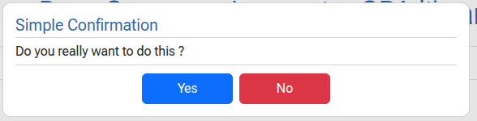
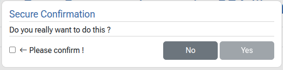

# Links

Links are natively for : 

- Linking to other web pages (*e.g.* `href="https://google.com"` )
- Internal navigation (*e.g.* `href="#section1"` )
- Triggering system actions (*e.g.* `href="mailto:email@example.com"` )
- Downloading files (when the `download` attribute is added)
- Wrapping elements

In single page applications navigation to site external pages is prohibited (since we want to stay on the page).

In our `ndspalib` we may add the `nd-link`  attribute to any HTML element. Adding this attribute tells the library to bypass the native behavior of links and to handle the element as a clickable element. In this perspective any element can become a link which can be clicked.

## Attributes

| Attribute    | Effect / Purpose                                             |
| ------------ | ------------------------------------------------------------ |
| `nd-link`    | The element is handled by the `ndspalib` library.<br>The element reacts to clicks.<br>The mouse cursor is set to  `pointer`. |
| `nd-url`     | The URL that will be fetched.                                |
| `nd-target`  | The target(s) to be updated with endpoint sent data.         |
| `nd-action`  | A reference to a JavaScript function (accessible in the `window` namespace) to be executed when the URL is fetched from the server. |
| `nd-confirm` | A reference to a confirmation dialog template.               |

## Attribute details

### `nd-url`

This attribute specifies where to get the data from. When the element is clicked, a `fetch` operation is launched. The returned data will be :

- injected into the target(s) if `nd-target` is specified
- injected as an argument into the JavaScript function specified in `nd-action`

### `nd-target`

This attribute defines the element(s) that will be updated with the server response. The attribute value must be compatible with the  JavaScript`querySelectorAll(...)` function, *i.e.* a space separated list of values. For example :

```html
<div nd-link nd-url="/poll" nd-target="main .css_class #element_id" class="...">Action !</div>
```

In this case :

- all `<main .../>` elements will be updated
- all elements bearing the `css_class` class will be affected
- the element having `id="element_id"` will be updated

### `nd-action`

This attribute permits the definition of a JavaScript function to be called before or after a `fetch` operation. For example :

Case A - **before** fetch (default) :

```html
<div nd-link nd-url="/poll" nd-action="my_action(arguments)" nd-target="#action" class="...">Action !</div>
```

Case B - **after** fetch :

```html
<div nd-link nd-url="/poll" nd-action="after::my_action(arguments)" nd-target="#action" class="...">Action !</div>
```

The JavaScript function may be defined in the active page or in the base page like this :

```html
<script>
    my_action = (args) => {
        // Get the detail (may be a simple string or a 'detail' object)
        var detail = (args instanceof Object && args.length > 0) ? args[0] : args;
        console.log('Returned detail:', detail);
    }
</script>
```

it is essential to add the `arguments` parameter into the `nd-action` . The `ndspalib` will update the `arguments` like this :

```javascript
var action_detail = {
    when: string,        // 'before' or 'after' fetch
    url: string,         // the url being fetched
    source: HTMLElement, // the element that was clicked
    targets: [],         // the list of targets (a list of HTMLElement)
    data: string,        // the fetched data  
};
```

The detail will then be available in the function. This allows to do specific operations with the returned data, *e.g.* parse a JSON string and update some sections on the page.

!!! Note
	The `detail.data` will be available  only if the `nd-action="..."` is prefixed with the `after::` modifier !

### `nd-confirm`

In some cases, one may want to confirm an operation before executing it. Our  `ndspalib` allows to trigger a modal dialog before an operations. We provide two kinds of dialogs (both modal) :

- A simple dialog with an accept and a dismiss button.
- A secured dialog with an accept (initially disabled) and a dismiss button, and a confirmation checkbox which activates/deactivates the accept button.

**➞** The title of such a dialog may be dynamically defined by using the 

```html
<... nd-confirm="template_id::title::Another title !" .../>
```

syntax. 

To add a confirmation dialog, we use following code :

```html
<!-- Simple confirmation -->
<button nd-link nd-url="/poll" nd-target="#confirm-1" nd-confirm="simple_confirm_dialog" class="...">Confirm</button>
<!-- Secure confirmation -->
<button nd-link nd-url="/poll" nd-target="#confirm-2" nd-confirm="secure_confirm_dialog" class="...">Confirm</button>
```

To define the dialog, we use `<template .../>`tags like this :

```html
<template id="simple_confirm_dialog">
    <param name="mode" value="simple">
    <param name="title" value="Simple Confirmation">
    <param name="message" value="Do you really want to do this ?">
    <param name="confirm" value=""> <!-- Not relevant here ! -->
    <param name="accept" value="Yes">
    <param name="dismiss" value="No">
</template>

<template id="secure_confirm_dialog">
    <param name="mode" value="secure">
    <param name="title" value="Secure Confirmation">
    <param name="message" value="Do you really want to do this ?">
    <param name="confirm" value="Please confirm !">
    <param name="accept" value="Yes">
    <param name="dismiss" value="No">
</template>
```

When the user clicks the link, the dialogs are displayed.

Simple confirm :

<figure markdown="span"></figure>

Secured confirm :

<figure markdown="span"></figure>
